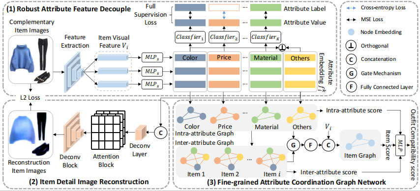

# DMAP: Decoupling-driven Multi-level Attribute Parsing for Interpretable Outfit Collocation

This is the code for the paper: "DMAP: Decoupling-driven Multi-level Attribute Parsing for Interpretable Outfit Collocation".

## Overview Framework

## Project introduction

1. data:
   The required data files, including:
   train/valid/test_list.csv : The training/validate/testing files for the Outfit Compatibility Prediction (OCP) task.
   test_fitb_p/n1/n2/n3.csv : The testing files for the  Fill-in-the-Blank (FITB)  task.
   item_img_num.csv : Attribute information obtained by statistics on IQON 3000 dataset.

2. Comp:
    The source code and pre-trained parameters of the PS-OCM.

    `python train.py --batch_size 16 --epoch_num 100 --imgpath (IQON3000 data path)`

3. FITB:
    The test code for the FITB task.
    `python compute_fitb.py --imgpath (IQON3000 data path)`
